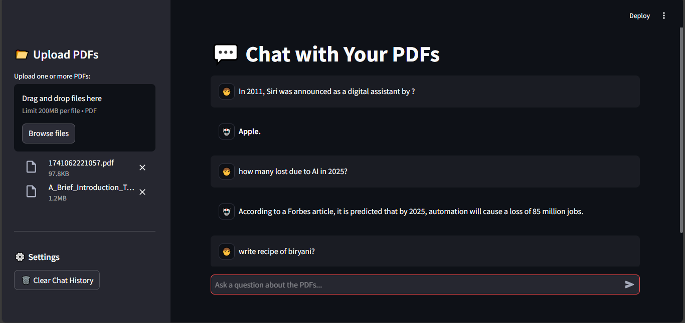
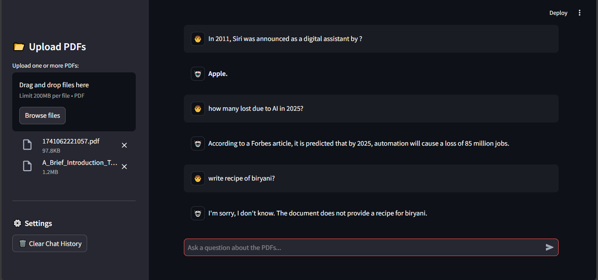

# Multi-PDF-Chatbot

AI-powered chatbot to query multiple PDFs using FAISS and embeddings.




## Features
- Upload multiple PDF documents
- Extract and process text using FAISS and Sentence Transformers
- Retrieve relevant information using embeddings
- Chat interface powered by Groq API

## Installation

Clone the repository:
```bash
git clone https://github.com/yourusername/multi-pdf-chatbot.git
cd multi-pdf-chatbot
```

Install dependencies:
```bash
pip install -r requirements.txt
```

## Usage

1. Run the Streamlit app:
```bash
streamlit run app.py
```
2. Upload your PDFs and start chatting!

## Environment Variables
Create a `.env` file and add your Groq API key:
```env
GROQ_API_KEY=your_api_key_here
```

## Folder Structure
```
📂 multi-pdf-chatbot
 ├── 📂 temp_files       # Temporary storage for uploaded PDFs
 ├── 📜 app.py          # Main application script
 ├── 📜 pdf_loader.py   # PDF processing utility
 ├── 📜 requirements.txt # Dependencies
 ├── 📜 .env.example    # Sample environment file
 ├── 📂 assets          # Images for README
```

## Contributing
Pull requests are welcome! Feel free to open an issue for any suggestions or improvements.

## License
This project is licensed under the MIT License.
